<!-- Desktop: สลับ dark/light อัตโนมัติตามธีมของคนดู -->
<picture>
  <source media="(prefers-color-scheme: dark)" srcset="./assets/hhtttd-beach-console-dark.svg">
  <source media="(prefers-color-scheme: light)" srcset="./assets/hhtttd-beach-console-light.svg">
  
</picture>

  

    <picture>
      <source media="(prefers-color-scheme: dark)" srcset="./assets/hhtttd-beach-console-mobile-dark.svg">
      <source media="(prefers-color-scheme: light)" srcset="./assets/hhtttd-beach-console-mobile-light.svg">
      
    </picture>
  

